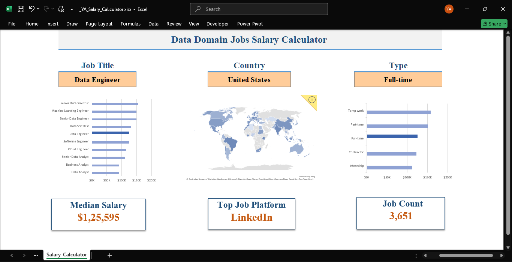

# Excel Salary Dashboard

## About This Project

The data jobs market is difficult to navigate — salaries vary significantly across roles, 
countries, and employment types, making it hard to benchmark compensation without a 
structured way to compare. This project addresses that gap.

The dataset contains real-world data science job postings from 2023, covering job titles, 
salaries, locations, and employment types. The core technical challenge was building a 
calculation engine that reacts instantly to any filter combination — achieved by chaining 
modern Excel functions like `XLOOKUP`, `FILTER`, and `SORT` with conditional aggregation 
using `MEDIAN`+`IF` to recompute every metric dynamically on each filter change, without 
PivotTables or Power Query.

---

## Dashboard Preview

---

## Features

**Dynamic Filters** — Three dropdown menus update the entire dashboard in real-time:
- Job Title (e.g., Data Engineer, Data Scientist)
- Country
- Employment Type (e.g., Full-time, Contractor)

**Interactive Visualizations:**
- **Salary by Job Title** — Horizontal bar chart showing median salary ranges across roles
- **Salary by Location** — Choropleth map for geographic salary comparison  
- **Salary by Employment Type** — Bar chart comparing salaries across contract types

**KPIs** — Three key metrics that auto-update based on active filters:
- **Median Salary** — Median salary for the filtered selection
- **Top Job Platform** — Most common platform for matching job postings
- **Job Count** — Total listings matching the active filters

---

## Technical Details

Built entirely in Excel — no plugins or add-ins used.

**Formulas & Functions:**
`XLOOKUP` · `FILTER` · `SORT` · `COUNTIFS` · `MEDIAN` (with IF logic) · `IF` · 
`ISNUMBER` · `SUBSTITUTE`

**Excel Features Used:**
- **Data Validation** — Searchable, dynamic dropdown filters
- **Conditional Formatting** — Enhanced chart and table readability
- **Named Ranges** — Clean, maintainable formula structure

---

## Dataset

Real-world data science job postings from 2023. Includes job titles, salaries, 
locations, and employment types across multiple countries and platforms.

---

## Skills Demonstrated

- End-to-end dashboard design and layout in Excel
- Advanced formula logic for dynamic filtering and aggregation
- Data visualization using charts and geographic maps
- KPI computation without external tools, plugins, or Power Query
